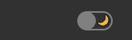
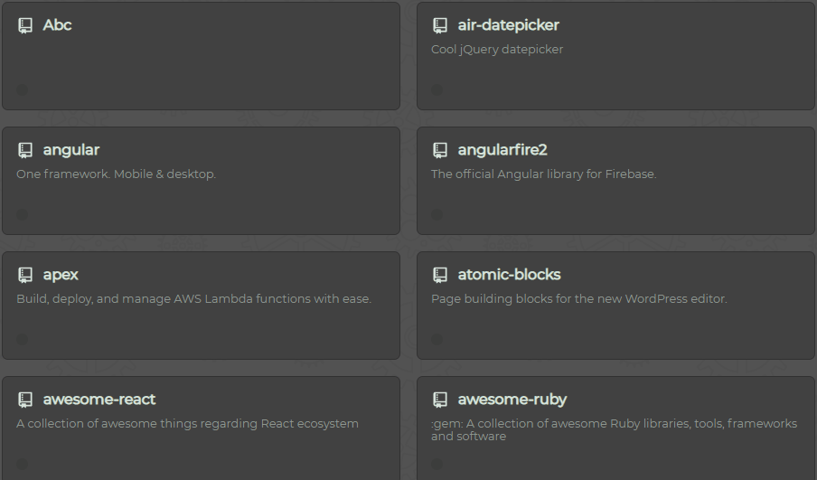
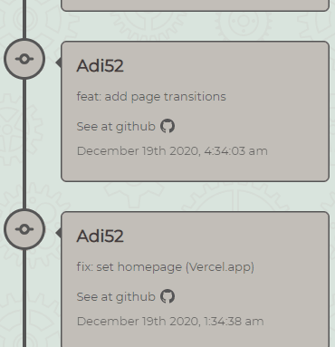
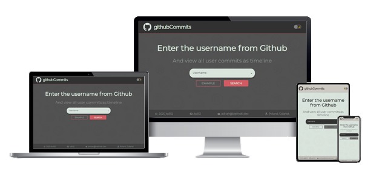

<p align="center">
  
  <h3 align="center">githubCommits</h3>
  <p align="center">
    <a href="https://github-commits-git-main.adi52.vercel.app/"><strong>View a Demo »</strong></a>
  </p>
</p>


## Table of contents
* [General info](#general-info)
  * [Theme Switcher](#theme-switcher)
  * [Infinite Scroll](#infinite-scroll)
* [Availability](#RWD)
* [Technologies](#technologies)
* [API](#API-cloud)
* [Setup](#setup-dvd)
* [Status](#status)
* [Inspiration](#inspiration)
* [Screenshots](#screenshots)
* [Contact](#contact-e-mail)

## General info

It is an application whose task is to display all repositories and commits in the form of a selected user's timeline. On the main page, there is a search input that connects to GitHub API and shows suggestions with nicknames of all GitHub users. Then we are transferred to the user's page, where there are Avatar, nickname, and first and last name. Below are all the user repositories. After clicking the repository we  are transferred to the subpage with all commits presented on the timeline.
Data in the app is loaded with Infinite scroll. Thanks to this, there is no risk that the page will load for too long.
There is a theme switcher in the header, thanks to which we can set the page style light or dark.

# Theme switcher
Thanks to this switcher we can set light/dark theme. It works with <b>React Context API</b>.

<p align="center">
  
</p>

# Infinite scroll    
All data is downloaded from API in packages of several pieces. Together with scroll down new data is fetched.

<p align="center">
  
</p>

<p align="center">
  
</p>

## RWD :computer:
The webpage is fully responsive. You can see clearly pages on any device. I prepared the 7 most popular breakpoints.
<p align="center">
  
</p>

## Technologies 
* react.js v 17.0.0.
* create-react-app
* GSAP
* axios
* styled-components
* react-transition-group


## API :cloud:
In this project I use only [Github REST API](https://docs.github.com/en/free-pro-team@latest/rest/guides/getting-started-with-the-rest-api).


## Setup :dvd:

> Live version: [click »](https://github-commits-git-main.adi52.vercel.app/)

* Clone repo: 
```
$ git clone https://github.com/Adi52/github-commits.git 
$ npm install 
```
* Generate your personal access token [here](https://github.com/settings/tokens).
* At main directory `github-commits` create new file `.env` and type there `REACT_APP_GITHUB_TOKEN=your token`.
* Example: `REACT_APP_GITHUB_TOKEN=qwertyuiopasdfghjklzxcvbnm123456890`.

`
$ npm start
`

*Type in the browser:  

`http://localhost:3000`


## Status
Project is: `finished`. I don’t plan to expand this, only a fix for bugs found.


## Inspiration
As I completed several React courses, I decided to do my first fully standalone project. I had a few ideas like an online shop, weather-app, etc. I wanted the project to be based on a connection to the server or a very extensive rest API. The choice fell on a great solution from Github, namely Github REST API.
Completing this project is a great achievement for me. Thanks to it, I applied in practice all the issues that I had learned and I’m gained practice in using <b> Hooks </b> and styled-components to style the project, I also had the opportunity to use GSAP and page transitions to perform simple animations.


## Screenshots
<p align="center">
  
</p>

<p align="center">
  
</p>


## Contact :e-mail:
Created by [bielinski.dev](https://github.com/adi52) - feel free to contact me!


